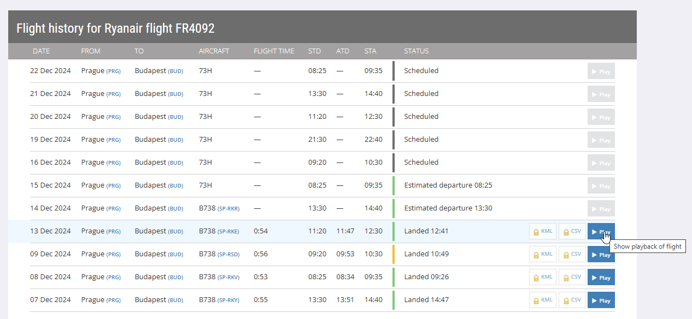
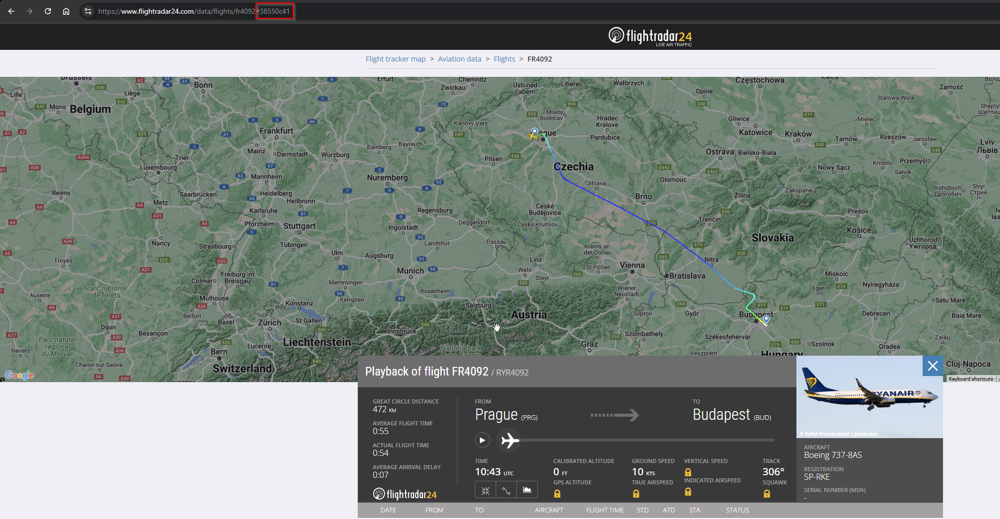
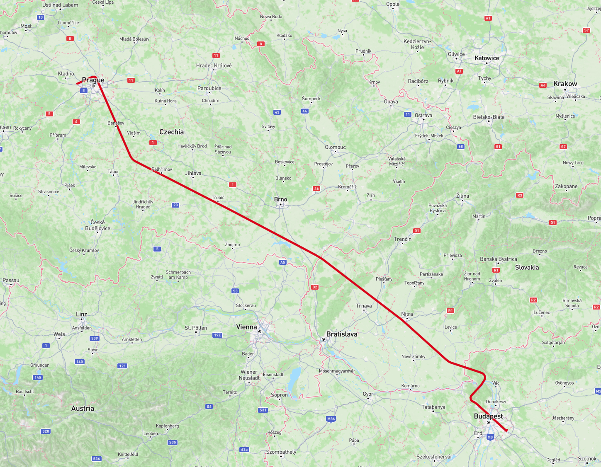

# How to use

- Obtain flight id from FlightRadar24
    1. Navigate to FlightRadar24.com
    2. Choose a flight and get to the playback
         
    3. Replay the flight and note the ID in the address bar
        

- Set ID in the script
    1. Run the script `python processing.py %flightid% %date%`
        e.g `python process.py 38ff21b6 04/02/2025-11:25`
    3. A GeoJSON file `track ORIGIN-DESTINATION.json` should appear in the script folder
       
